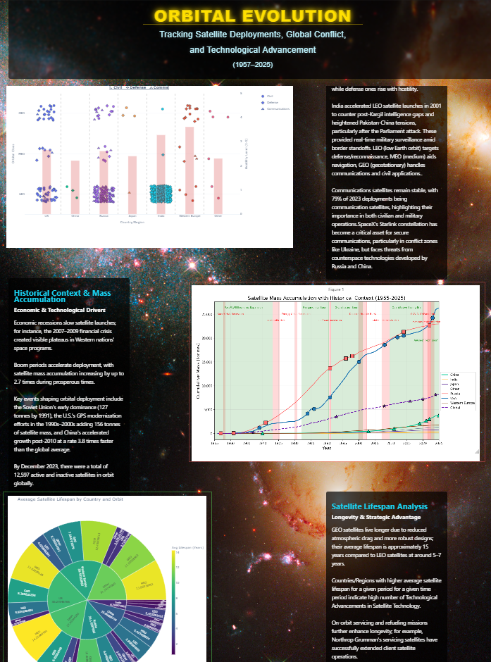
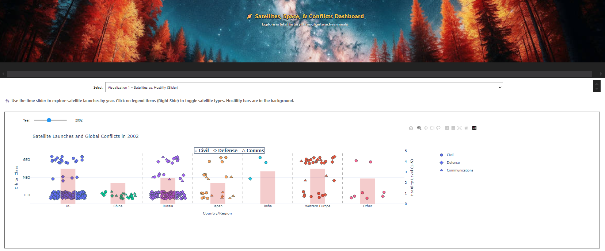
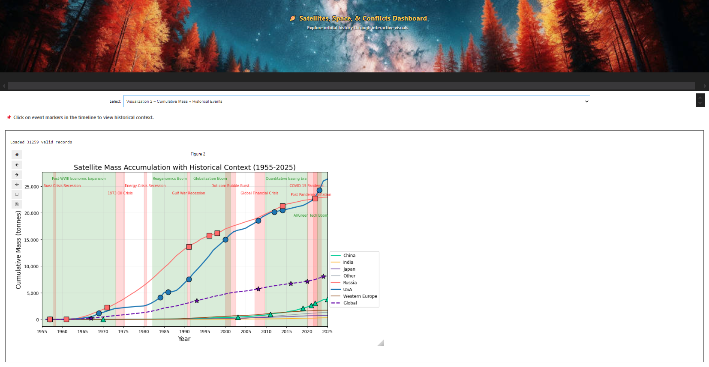
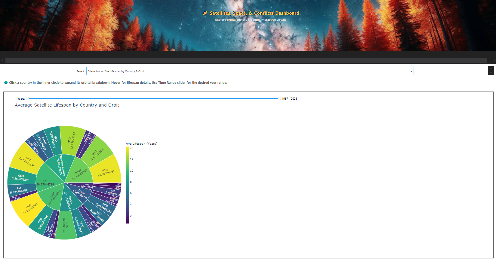

# Satellite Conflict Analysis Dashboard  
**Interactive visualization of orbital deployments and geopolitical tensions (1992-2025)**  

## Sample Output(Screenshots; Better to Run in Code)

## 🚀 Installation & Dependencies
**Python 3.7+ Required**  

**Jupyter Extensions** (for interactive widgets):  

## 📂 Dataset Requirements
| File | Source | Critical Notes |
|------|--------|----------------|
| `satcat.csv` | [SatCat](https://planet4589.org/space/gcat/web/cat/cols.html) | Pre-converted from TSV [using this tool](https://onlinetsvtools.com/convert-tsv-to-csv) |
| `MIDIP 5.0.csv` | [MIDIP](https://correlatesofwar.org/data-sets/mids/) | Original conflict dataset |

## Satellite Conflict Analysis Dashboard

*Satellite Conflict Analysis Dashboard is a **data-driven analytics platform** built to visualize the **relationship between global satellite deployments and geopolitical conflicts** from 1992 to 2025. It integrates **over 30,000 satellite records (SATCAT)** with **conflict event data (MIDIP 5.0)** to enable real-time, interactive **analysis of orbital trends and state behavior**.*

### Key contributions include:

* A **Python-based ETL pipeline** for cleaning, filtering, and harmonizing datasets across time, space, and satellite function (civil, defense, comms).
* **Feature engineering for orbital classification** (LEO/MEO/GEO), launch mass normalization, and integration of contextual markers (economic cycles, major events).
* An interactive Jupyter dashboard using Plotly, Matplotlib, and ipywidgets with year-based filtering, country-wise views, and layered visualizations.

### Tools include:

* A **cumulative mass timeline with historical annotations**
* A **temporal deployment view + conflict overlay**
* A **hierarchical sunburst chart** for analyzing satellite lifespan by country and orbit

*Backend logic uses **callback-driven updates** for efficient, dynamic filtering.*

### Insights generated include:

* Strategic trends like a **2.7× acceleration in launch mass** during boom periods
* Increased **LEO deployments following regional conflicts** (e.g., India post-Kargil)

*Built entirely in Python, the project demonstrates end-to-end capabilities in **data integration**, **interactive visualization**, and **aerospace-geopolitical analytics**.*

## Old description

**Preprocessing Already Done** in provided files:
- Date range: 1992-2015
- Country grouping (US/China/Russia/Japan/India/Western Europe/Other)
- Orbital class calculations (LEO/MEO/GEO)
- Mass validation & error handling

## 🛰️ Key Features
### 1. Temporal Analysis Dashboard
- **Year Slider**: Explore 1992-2014 with hostility level overlays
- **Satellite Types**: Toggle civil/defense/comm satellites on the right side
- **Orbit Layers**: Compare LEO/MEO/GEO distributions

### 2. Mass Accumulation Timeline
- **Clickable Historical Markers**: Sputnik Crisis, Challenger Disaster, COVID impacts
- **Economic Context**: Recession/boom period shading
- **Country Trajectories**: Compare US/China/Russia mass accumulation

### 3. Lifespan Sunburst Chart
- **Interactive Drill-Down**: Country → Orbit → Avg lifespan
- **Time Filter**: 1957-2025 range slider
- "Click Country" : clicking country expands its orbital satellite distribution
- **Color Coding**: Purple (short) → Yellow (long)

## 🔧 Troubleshooting
**If widgets don't load**:  
1. Restart Jupyter kernel  
2. Run all cells
2. Verify extensions:  

**Common Data Issues**:  
Ensure MIDIP 5.0.csv is unmodified  
Use provided satcat.csv (pre-converted from tsv)  

## ✅ Data Validation

## 📜 Attribution
- Conflict Data: [MIDIP 5.0](https://correlatesofwar.org/data-sets/mids/) (Correlates of War Project)  
- Satellite Catalog: [SatCat](https://planet4589.org/space/gcat/web/cat/cols.html) (Jonathan McDowell)  
- TSV Conversion: [OnlineTSVTools](https://onlinetsvtools.com/convert-tsv-to-csv)  
- Vector Graphics: [Freepik](https://www.freepik.com) (modified under premium license)  
- Analysis & Visualization: [Abhijeet Singh]  

---

**Launch Instructions**:  
1. Place both CSV files in project root  
2. Start Jupyter: `jupyter lab`  
3. Run all cells (Widgets may take 10-15s to initialize)  

